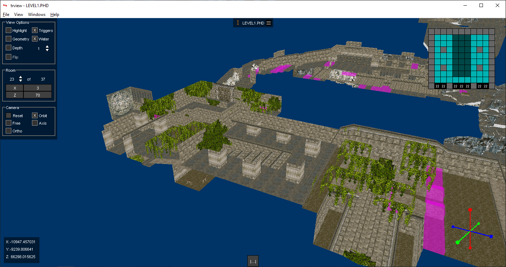

# trview

trview is a level visualiser for Tomb Raider 1 - 5 made with speedrunning 
in mind. This program is useful to quickly check how the rooms are laid out,
see the triggers present on them and analyse route possibilities.



# License

This program is licensed under the MIT license. Please read the LICENSE text
document included with the source code if you would like to read the terms of 
the license. The license can also be found online at https://opensource.org/licenses/MIT.

# Download

Source code archives and Windows binaries are available from the trview
Releases section on GitHub:

https://github.com/chreden/trview/releases

# Building

Open the project file (.sln) with Visual Studio Community 2022 and click on
Build > Build Solution.

To run the tests you will need to install the 'Test Adapter for Google Test' - it can be found in Individual Components in the Visual Studio Installer.

# Running

Double click a level file (.TR2, .TR4, .TRC or .PHD) present in the game's data folder 
and choose to open it with trview.exe. You can also open trview by itself and choose
a level file using the File menu or drag and drop a level file onto the window.

# [Controls](doc/controls.md)
Hotkeys and movement controls.

# [Windows](doc/windows.md)
The 3D view and list windows.

# [Menus](doc/menus.md)
Menus accessible through the menu bar in the host window.

# [Filters](doc/filters.md)
Filters appear in several windows and can be used to apply logic to include or exclude the subjects of the window.

# [Randomizer Integration](doc/rando.md)
TRView has an integration with the [Randomizer](https://github.com/LostArtefacts/TR-Rando). This is used during Randomizer development.

# [Lua bindings](doc/lua/index.md)
TRView has Lua bindings that can be used by the console and plugins.

# Licenses

## Lua

```
Copyright © 1994–2022 Lua.org, PUC-Rio.
Permission is hereby granted, free of charge, to any person obtaining a copy of this software and associated documentation files (the "Software"), to deal in the Software without restriction, including without limitation the rights to use, copy, modify, merge, publish, distribute, sublicense, and/or sell copies of the Software, and to permit persons to whom the Software is furnished to do so, subject to the following conditions:

The above copyright notice and this permission notice shall be included in all copies or substantial portions of the Software.

THE SOFTWARE IS PROVIDED "AS IS", WITHOUT WARRANTY OF ANY KIND, EXPRESS OR IMPLIED, INCLUDING BUT NOT LIMITED TO THE WARRANTIES OF MERCHANTABILITY, FITNESS FOR A PARTICULAR PURPOSE AND NONINFRINGEMENT. IN NO EVENT SHALL THE AUTHORS OR COPYRIGHT HOLDERS BE LIABLE FOR ANY CLAIM, DAMAGES OR OTHER LIABILITY, WHETHER IN AN ACTION OF CONTRACT, TORT OR OTHERWISE, ARISING FROM, OUT OF OR IN CONNECTION WITH THE SOFTWARE OR THE USE OR OTHER DEALINGS IN THE SOFTWARE.
```

## nlohmann/json

```    
    __ _____ _____ _____
 __|  |   __|     |   | |  JSON for Modern C++
|  |  |__   |  |  | | | |  version 3.1.2
|_____|_____|_____|_|___|  https://github.com/nlohmann/json

Licensed under the MIT License <http://opensource.org/licenses/MIT>.
SPDX-License-Identifier: MIT
Copyright (c) 2013-2018 Niels Lohmann <http://nlohmann.me>.

Permission is hereby  granted, free of charge, to any  person obtaining a copy
of this software and associated  documentation files (the "Software"), to deal
in the Software  without restriction, including without  limitation the rights
to  use, copy,  modify, merge,  publish, distribute,  sublicense, and/or  sell
copies  of  the Software,  and  to  permit persons  to  whom  the Software  is
furnished to do so, subject to the following conditions:

The above copyright notice and this permission notice shall be included in all
copies or substantial portions of the Software.

THE SOFTWARE  IS PROVIDED "AS  IS", WITHOUT WARRANTY  OF ANY KIND,  EXPRESS OR
IMPLIED,  INCLUDING BUT  NOT  LIMITED TO  THE  WARRANTIES OF  MERCHANTABILITY,
FITNESS FOR  A PARTICULAR PURPOSE AND  NONINFRINGEMENT. IN NO EVENT  SHALL THE
AUTHORS  OR COPYRIGHT  HOLDERS  BE  LIABLE FOR  ANY  CLAIM,  DAMAGES OR  OTHER
LIABILITY, WHETHER IN AN ACTION OF  CONTRACT, TORT OR OTHERWISE, ARISING FROM,
OUT OF OR IN CONNECTION WITH THE SOFTWARE  OR THE USE OR OTHER DEALINGS IN THE
SOFTWARE.
```

## zlib

```
zlib.h -- interface of the 'zlib' general purpose compression library
version 1.2.11, January 15th, 2017

Copyright (C) 1995-2017 Jean-loup Gailly and Mark Adler

This software is provided 'as-is', without any express or implied
warranty.  In no event will the authors be held liable for any damages
arising from the use of this software.

Permission is granted to anyone to use this software for any purpose,
including commercial applications, and to alter it and redistribute it
freely, subject to the following restrictions:

1. The origin of this software must not be misrepresented; you must not
    claim that you wrote the original software. If you use this software
    in a product, an acknowledgment in the product documentation would be
    appreciated but is not required.
2. Altered source versions must be plainly marked as such, and must not be
    misrepresented as being the original software.
3. This notice may not be removed or altered from any source distribution.

Jean-loup Gailly        Mark Adler
jloup@gzip.org          madler@alumni.caltech.edu


The data format used by the zlib library is described by RFCs (Request for
Comments) 1950 to 1952 in the files http://tools.ietf.org/html/rfc1950
(zlib format), rfc1951 (deflate format) and rfc1952 (gzip format).
```

## DirectXTK

```
                               The MIT License (MIT)

Copyright (c) 2018 Microsoft Corp

Permission is hereby granted, free of charge, to any person obtaining a copy of this 
software and associated documentation files (the "Software"), to deal in the Software 
without restriction, including without limitation the rights to use, copy, modify, 
merge, publish, distribute, sublicense, and/or sell copies of the Software, and to 
permit persons to whom the Software is furnished to do so, subject to the following 
conditions: 

The above copyright notice and this permission notice shall be included in all copies 
or substantial portions of the Software.  

THE SOFTWARE IS PROVIDED "AS IS", WITHOUT WARRANTY OF ANY KIND, EXPRESS OR IMPLIED, 
INCLUDING BUT NOT LIMITED TO THE WARRANTIES OF MERCHANTABILITY, FITNESS FOR A 
PARTICULAR PURPOSE AND NONINFRINGEMENT. IN NO EVENT SHALL THE AUTHORS OR COPYRIGHT 
HOLDERS BE LIABLE FOR ANY CLAIM, DAMAGES OR OTHER LIABILITY, WHETHER IN AN ACTION OF 
CONTRACT, TORT OR OTHERWISE, ARISING FROM, OUT OF OR IN CONNECTION WITH THE SOFTWARE 
OR THE USE OR OTHER DEALINGS IN THE SOFTWARE.
```

## Googletest/Googlemock

```
Copyright 2008, Google Inc.
All rights reserved.

Redistribution and use in source and binary forms, with or without
modification, are permitted provided that the following conditions are
met:

    * Redistributions of source code must retain the above copyright
notice, this list of conditions and the following disclaimer.
    * Redistributions in binary form must reproduce the above
copyright notice, this list of conditions and the following disclaimer
in the documentation and/or other materials provided with the
distribution.
    * Neither the name of Google Inc. nor the names of its
contributors may be used to endorse or promote products derived from
this software without specific prior written permission.

THIS SOFTWARE IS PROVIDED BY THE COPYRIGHT HOLDERS AND CONTRIBUTORS
"AS IS" AND ANY EXPRESS OR IMPLIED WARRANTIES, INCLUDING, BUT NOT
LIMITED TO, THE IMPLIED WARRANTIES OF MERCHANTABILITY AND FITNESS FOR
A PARTICULAR PURPOSE ARE DISCLAIMED. IN NO EVENT SHALL THE COPYRIGHT
OWNER OR CONTRIBUTORS BE LIABLE FOR ANY DIRECT, INDIRECT, INCIDENTAL,
SPECIAL, EXEMPLARY, OR CONSEQUENTIAL DAMAGES (INCLUDING, BUT NOT
LIMITED TO, PROCUREMENT OF SUBSTITUTE GOODS OR SERVICES; LOSS OF USE,
DATA, OR PROFITS; OR BUSINESS INTERRUPTION) HOWEVER CAUSED AND ON ANY
THEORY OF LIABILITY, WHETHER IN CONTRACT, STRICT LIABILITY, OR TORT
(INCLUDING NEGLIGENCE OR OTHERWISE) ARISING IN ANY WAY OUT OF THE USE
OF THIS SOFTWARE, EVEN IF ADVISED OF THE POSSIBILITY OF SUCH DAMAGE.
```

## Dear ImGui

https://github.com/ocornut/imgui
```
The MIT License (MIT)

Copyright (c) 2014-2024 Omar Cornut

Permission is hereby granted, free of charge, to any person obtaining a copy
of this software and associated documentation files (the "Software"), to deal
in the Software without restriction, including without limitation the rights
to use, copy, modify, merge, publish, distribute, sublicense, and/or sell
copies of the Software, and to permit persons to whom the Software is
furnished to do so, subject to the following conditions:

The above copyright notice and this permission notice shall be included in all
copies or substantial portions of the Software.

THE SOFTWARE IS PROVIDED "AS IS", WITHOUT WARRANTY OF ANY KIND, EXPRESS OR
IMPLIED, INCLUDING BUT NOT LIMITED TO THE WARRANTIES OF MERCHANTABILITY,
FITNESS FOR A PARTICULAR PURPOSE AND NONINFRINGEMENT. IN NO EVENT SHALL THE
AUTHORS OR COPYRIGHT HOLDERS BE LIABLE FOR ANY CLAIM, DAMAGES OR OTHER
LIABILITY, WHETHER IN AN ACTION OF CONTRACT, TORT OR OTHERWISE, ARISING FROM,
OUT OF OR IN CONNECTION WITH THE SOFTWARE OR THE USE OR OTHER DEALINGS IN THE
SOFTWARE.
```

## FreeType

https://github.com/freetype/freetype

```
[The FreeType Project LICENSE](external/freetype/FTL.txt)


Portions of this software are copyright © 2023 The FreeType
Project (www.freetype.org).  All rights reserved.
```

## miniaudio

https://github.com/mackron/miniaudio/

```
===============================================================================
MIT No Attribution
===============================================================================
Copyright 2023 David Reid

Permission is hereby granted, free of charge, to any person obtaining a copy of
this software and associated documentation files (the "Software"), to deal in
the Software without restriction, including without limitation the rights to
use, copy, modify, merge, publish, distribute, sublicense, and/or sell copies
of the Software, and to permit persons to whom the Software is furnished to do
so.

THE SOFTWARE IS PROVIDED "AS IS", WITHOUT WARRANTY OF ANY KIND, EXPRESS OR
IMPLIED, INCLUDING BUT NOT LIMITED TO THE WARRANTIES OF MERCHANTABILITY,
FITNESS FOR A PARTICULAR PURPOSE AND NONINFRINGEMENT. IN NO EVENT SHALL THE
AUTHORS OR COPYRIGHT HOLDERS BE LIABLE FOR ANY CLAIM, DAMAGES OR OTHER
LIABILITY, WHETHER IN AN ACTION OF CONTRACT, TORT OR OTHERWISE, ARISING FROM,
OUT OF OR IN CONNECTION WITH THE SOFTWARE OR THE USE OR OTHER DEALINGS IN THE
SOFTWARE.
```