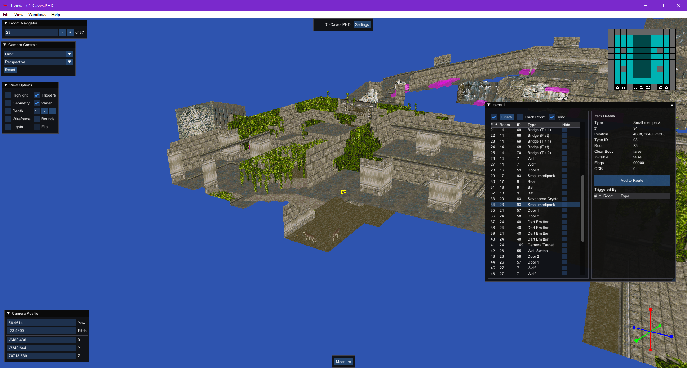
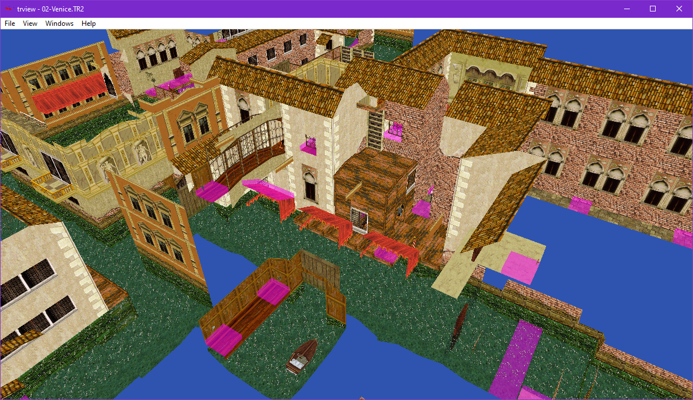
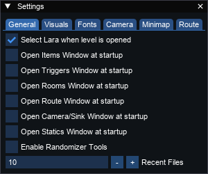
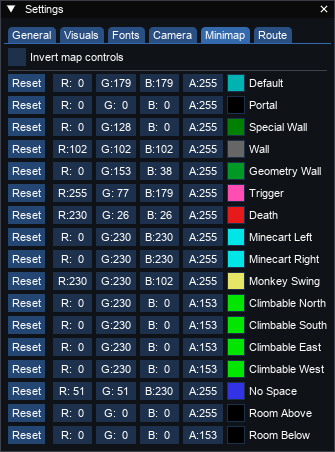
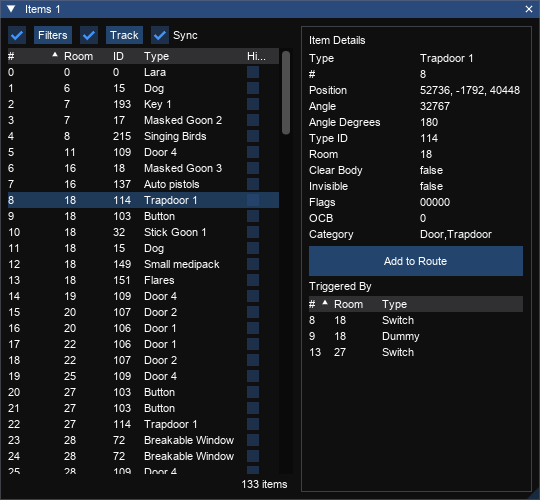
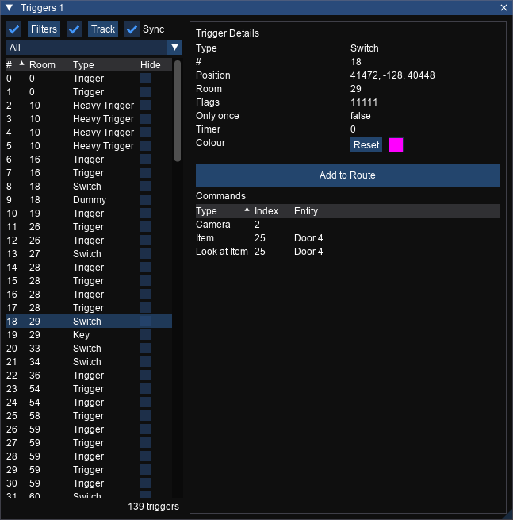
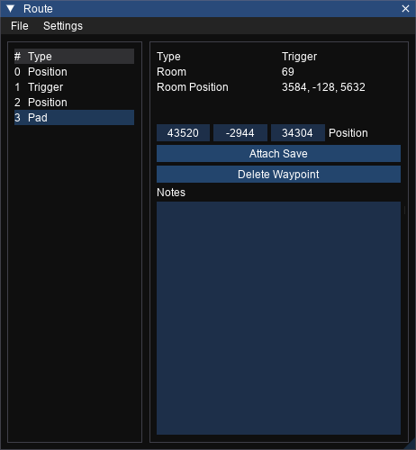
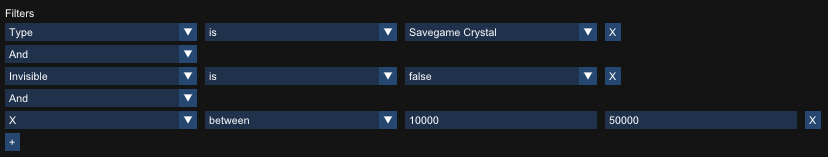

# trview

trview is a level visualiser for Tomb Raider 1 - 5 made with speedrunning 
in mind. This program is useful to quickly check how the rooms are laid out,
see the triggers present on them and analyse route possibilities.



# License

This program is licensed under the MIT license. Please read the LICENSE text
document included with the source code if you would like to read the terms of 
the license. The license can also be found online at https://opensource.org/licenses/MIT.

# Download

Source code archives and Windows binaries are available from the trview
Releases section on GitHub:

https://github.com/chreden/trview/releases

# Building

Open the project file (.sln) with Visual Studio Community 2022 and click on
Build > Build Solution.

To run the tests you will need to install the 'Test Adapter for Google Test' - it can be found in Individual Components in the Visual Studio Installer.

# Running

Double click a level file (.TR2, .TR4, .TRC or .PHD) present in the game's data folder 
and choose to open it with trview.exe. You can also open trview by itself and choose
a level file using the File menu or drag and drop a level file onto the window.

# Controls

## General

Key|Action
---|------
CTRL + O    | Open file
CTRL + G    | Show 'go to room' box
CTRL + E    | Show 'go to item' box
CTRL + R    | Open Route window
CTRL + T    | New Triggers window
CTRL + I    | New Items window
CTRL + M    | New Rooms window
CTRL + L    | New Lights window
F1          | Toggle settings window
F           | Free camera
G           | Toggle hidden geometry
H           | Toggle room highlighting
L           | Toggle lights visibility
O           | Orbit camera
P           | Toggle flipmap
T           | Toggle trigger visibility
X           | Axis camera
INSERT      | Reset camera
Left mouse  | Click on a room to go to that room
:arrow_left: | Go to previous waypoint in route
:arrow_right: | Go to next waypoint in route
Delete      | Delete the currently selected waypoint
Right mouse | Show the context menu

## Free View

Key|Action
---|------
W                       | Move forward
A                       | Move left
S                       | Move backwards
D                       | Move right
E                       | Move up
Q                       | Move down
Right mouse + move      | Change look direction
Mouse wheel             | Zoom in/out

## Axis View

Key|Action
---|------
W                       | Move forward along Z axis
S                       | Move backwards along Z axis
A                       | Move backwards along X axis
D                       | Move forward along X axis
E                       | Move up
Q                       | Move down
Right mouse + move      | Change look direction

## Orbit View

Key|Action
---|------
Left mouse + move         | Pan camera
Right mouse + move        | Rotate around target
Left + Right mouse + move | Vertical panning
Mouse wheel               | Zoom in/out

# Viewer

The viewer is the main 3D view for trview. It shows and and allows you to interact with the current level.

## View Options

Controls the appearance of the level in the 3D view.

TR1-3 | TR4+
---|---
 | 

Option|Action
---|------
Highlight           | Highlight the currently selected room
Triggers            | Toggle trigger visibility
Geometry            | Toggle hidden geometry visibility
Water               | Toggle water in water rooms
Depth               | Toggle depth mode. This will show the currently selected depth of neighbours of the current room.
Depth Selector      | Choose the depth of neighbours to show
Wireframe           | Enable wireframe rendering mode
Bounds              | Show static mesh bounding boxes
Lights              | Toggle lights visibility
Flip                | Toggle the level flipmap (if present in the level). In TR4+ this will be a flipmap group selector.

## Room Navigator

The room navigator shows the current room, the number of rooms in the level and allows you to enter a room number or cycle through them with the `-` or `+` buttons.


Option|Action
---|---
Number input       | Enter a room number and press `Enter` to go to it
`-` | Go to the previous room (hold `CTRL` to skip by 10)
`+` | Go to the next room (hold `CTRL` to skip by 10)

## Camera

Shows options for the camera.


### Camera Mode
Option|Action
---|------
Orbit               | Use orbit mode - this orbits a room or item
Free                | Use free mode
Axis                | Use axis mode - this is like free, but the controls map to X/Z/Y axis (rotation is ignored)

### Projection mode

Controls the way the camera is projected. Perspective is how we see the world whereas orthographic removes any distortion from depth.

Option|Action
---|------
Persepective | Use persepective projection
Orthographic | Use orthographic projection

#### Perspective
 

#### Orthographic


Orthographic mode can be useful when paired with the compass selector to choose a fixed camera orientation. You can use this to create a top-down camera without any perspective.


### Reset
Reset the orbit camera to default rotation.

## Go To Room
_Shortcut: Ctrl+G_

Enter a room number and press enter to go to that room.


## Go To Item
_Shortcut: Ctrl+E_

Enter an item number and press enter to go to that item.


## Minimap

Shows relevant triggers, portals and floor data from the currently selected room.


Key|Action
---|------
Left click          | If a trigger square, will select the trigger. If not a trigger (or `CTRL` is pressed) it will follow a portal, or go to the room below. 
Right click         | Goes to the room above, if one is present.

## Level Info

The level info display useful informationn about the current level.


### Game Version
An icon representing the version of the game is displayed to the left of the level name.

### Level Name
The filename of the current level is displayed for reference.

### Settings
Clicking the settings button will open [Settings] for trview.

## Settings

The settings window allows you to change how parts of trview behave.

### General


### Camera


### Minimap


## Measure

The measure tool can be used to measure a distance: 
* Click on the measure button at the bottom of the 3D view or press the M key 
* Click on a point in the world
* Click on a second point
A path will appear between the two points with a distance label. This is the distance in units of 1024.

## Compass

When a level is open the 3D compass is displayed at the bottom right.


This shows the current direction of each axis, relative to the current camera view. 
Each of the nodes at the end of the axis lines can be clicked on to align the camera to that direction. Hovering over a node will show a tooltip with the name of the axis and the direction.

Node|Axis
---|---
Red|Y
Green|X
Blue|Z

## Camera Position

The camera position window shows and allows you to edit the position and rotation of the camera.


Property|Meaning|Notes
---|---|
Yaw|Rotation around the vertical axis (looking left and right)|Can be displayed in degrees or radians depending on settings
Pitch|Rotation around the horizontal axis (tilting up and down)|Can be displayed in degrees or radians depending on settings
X|X position of the camera in level space
Y|Y position of the camera in level space
Z|Z position of the camera in level space

## Context Menu
The context menu is opened by right clicking in the 3D view.

### Add Waypoint
Add a new route waypoint at this position. This is only available when a surface was clicked.

### Add Mid-Waypoint
Add a new route waypoint at the centre of the square that was clicked. This is only available when a floor was clicked.

### Remove Waypoint
Remove the clicked waypoint from the route. This is only available when a waypoint was clicked.

### Orbit Here
Switch the camera to orbit mode and orbit around the position that was right clicked when the context menu was opened. This is only available when a surface was clicked on.

### Hide
Hide the clicked entity or trigger. This can be unhidden from the view menu or the items or triggers window. This is only available if an item or trigger was clicked.

## Menus

### File

#### Open
Open a level file.
#### Open Recent
Open a recently opened file. Up to 10 successfully opened files will appear here.
#### Switch Level
Open another level in the same folder as the currently opened level file.
#### Exit
Close trview.

### View
#### UI
Toggle on or off visibility of all UI elements. This will override the other visibility options below if set to off.
#### Minimap
Toggle visibility of the minimap.
#### Tooltip
Toggle visibility of the tooltip when hovering over elements in the viewer.
#### Compass
Toggle visibility of the compass.
#### Selection
Toggle visibility of the selection highlights.
#### Route
Toggle visibility of the route waypoints and paths.
#### Tools
Toggle visibility of the tools, such as the measure tool.
#### Unhide All
Unhides all entities and triggers that have been hidden via the context menu or their windows.

### Windows
#### Items
Create a new items window.
#### Triggers
Create a new triggers window.
#### Rooms
Create a new rooms window.
#### Route
Create or open the route window.
#### Lights
Create a new lights window.

### Help
#### Github
Go to the trview GitHub page. 
#### Discord
Permanent invite to the trview Discord.
#### About
Show the about box.

# Items Window
_Shortcut: Ctrl+I_

Shows the list of items that exist in the current level and allows you to filter, sort, inspect and add items to a route.



## Options

Input|Action
---|------
Filters | Open the [filters] editor. The checkbox toggles whether configured filters are applied.
Track Room          | Whether to show the items that are in the currently selected room
Sync | Whether the item selected in the window will be synced with the item selected in the view (bidirectional)

## Items List

Column | Meaning
---|---
\# | The item number
Room | The number of the room that the item is in
ID | The type ID of the item
Type | The type name of the item
Hide | Whether to hide this item in the viewer

## Item Details

Stat | Meaning
--- | ---
Type | The type name of the item
\# | The item number
Position | The position of the item in world space
Type ID | The type ID of the item
Room | The number of the room that the item is in
Clear Body | Whether to remove a dead body when a bodybag trigger is triggered
Invisible | Whether this item is invisible
Flags | Entity activation flags
OCB | Used to change entity behaviour

## Add To Route
Clicking the `Add to Route` button will insert this item at the current position in the route.

## Triggered By
The `Triggered By` list shows the triggers that can trigger the item. Clicking a trigger in the list will select that trigger.

Column | Meaning
---|---
\# | The trigger number
Room | The number of the room that the trigger is in
Type | The type name of the trigger


### Triggers Window
_Shortcut: Ctrl+T_

Shows the list of triggers that exist in the current level and allows you to filter, sort, inspect and add triggers to a route.



## Options

Input|Action
---|------
Filters | Open the [filters] editor. The checkbox toggles whether configured filters are applied.
Track Room          | Whether to show the triggers that are in the currently selected room
Sync | Whether the trigger selected in the window will be synced with the trigger selected in the view (bidirectional)

## Triggers List

Column | Meaning
---|---
\# | The trigger number
Room | The number of the room that the trigger is in
Type | The type of the trigger
Hide | Whether to hide this trigger in the viewer

## Trigger Details

Stat | Meaning
--- | ---
Type | The type of the trigger
\# | The trigger number
Position | The position of the trigger in world space
Room | The number of the room that the trigger is in
Flags | Activation mask
Only Once | Whether this trigger can only be triggered once
Timer | Used to time trigger activation/deactivation

## Add To Route
Clicking the `Add to Route` button will insert this trigger at the current position in the route.

## Commands
The `Commands` list shows the commands that will be executed when the trigger is activated. Clicking commands that reference an `Item` will select this `item` in the viewer.

Column | Meaning
---|---
Type | The type name of the trigger
Index | The numerical value for this trigger - this could be an item number or some other value
Entity | The name of the entity referenced if appropriate


# Rooms Window
_Shortcut: Ctrl+M_

Shows the list of rooms that exist in the current level and allows you to filter, sort and inspect rooms.


## Options

Input|Action
---|------
Filters | Open the filters editor. The checkbox toggles whether configured filters are applied.
Sync | Whether the room selected in the window will be synced with the room selected in the view (bidirectional)
Track Item | Whether to change selected room when an item is selected
Track Trigger | Whether to change selected room when a trigger is selected

## Rooms List

Column | Meaning
---|---
\# | The room number
Items | The number of the items in the room
Triggers | The number of triggers in the room

## Minimap

The minimap shows the sectors in the currently selected room.

Key|Action
---|------
Left click          | If a trigger square, will select the trigger. If not a trigger (or `CTRL` is pressed) it will follow a portal, or go to the room below. 
Right click         | Goes to the room above, if one is present.

## Properties

Lists the various properties of the room.

Property | Meaning | Notes
---|---|---
X | X position of the room
Y | Y position of the room
Z | Z position of the room
Water | Whether the water bit flag is set | Bit 0
Bit 1 | Whether bit 1 is set
Bit 2 | Whether bit 2 is set
Outside / 3 | Whether the room can see the skybox | Bit 3
Bit 4 | Whether bit 4 is set
Wind / 5 | Whether there is wind in the room | Bit 5
Bit 6 | Whether bit 6 is set
Quicksand / Block Lens Fare / 7 / | In TR3 specifies a quicksand room. In TR4+ blocks global lens flare | Bit 7
Caustics / 8 | Whether bit 8 is set
Reflectivity / 9 | Whether bit 9 is set
Snow / 10 | Whether bit 10 is set | Bit 10 (Snow in NGLE)
Rain / D / 11 | Whether bit 11 is set | Bit 11 (Rain in NGLE, D in TRLE)
Bit 12 | Whether bit 12 is set | Bit 12 (Cold in NGLE, P in TRLE)
Bit 13 | Whether bit 13 is set
Bit 14 | Whether bit 14 is set
Bit 15 | Whether bit 15 is set

## Items

Shows the items that are contained in the room. Clicking an item will select it in the viewer.

Column | Meaning
---|---
\# | The item number
Type | The type of the item triggered

## Neighbours

Shows the rooms that are immediate neighbours of this room. Clicking one of the rooms will select it.

Column | Meaning
---|---
\# | The room number

## Triggers

Shows the triggers that are in the room. Clicking one will select it in the viewer.

Column | Meaning
---|---
\# | The room number
Type | The type of trigger

# Route Window

_Shortcut: Ctrl + R_

Shows the list of waypoints in the current route and allows them to be edited and rearraanged.



## Route Colour

Clicking on the coloured square will show a colour picker dialog. The colour you choose will be used for the waypoints in the 3D view.

## Import

Opens a dialog to select a trview route file to import. Importing a route file will replace the current route.

## Export

Opens a dialog to export a trview route file to file.

## Waypoint List

Shows the waypoints that make up the current route. Clicking a waypoint will show the details of that waypoint in the route window and select it in the viewer. Waypoints can be rearranged by dragging and dropping them.

Column|Meaning
---|------
\# | Position of the waypoint in the route
Type | The waypoint type

## Waypoint Details
Shows various stats about the waypoint.

Stat | Meaning
---|---
Type | Waypoint type. Possible values: Position, Entity, Trigger.
Position | Position of the waypoint in the world
Room | The room the waypoint is in
Room Position | The position of the waypoint in room coordinates

## Saves
A save file can be attached to each waypoint.

Button | Action | Note
---|---|---
Attach Save | Opens a dialog to select a save file | Only available when there is no file attached
SAVEGAME.0 | Opens a dialog to export the attached save file | Only available when there is a file attached
`X` | Remove the attached save file | 

## Delete Waypoint
Deletes the waypoint from the route.

## Notes
Shows and allows editing of the notes associated with this waypoint.

The selected waypoint will have its details shown in the right panel. The notes for the route can be edited by typing in the 'Notes' text area.

# Lights Window


## Options

Input|Action
---|------
Filters | Open the [filters] editor. The checkbox toggles whether configured filters are applied.
Track Room          | Whether to show the items that are in the currently selected room
Sync | Whether the light selected in the window will be synced with the light selected in the view (bidirectional)

## Lights List

Column | Meaning
---|---
\# | The light number
Room | The number of the room that the light is in
Type | The type name of the light
Hide | Whether to hide this light in the viewer

## Light Details

Stat | Light Type | Game Version | Meaning 
--- | --- | ---
Type | All | All | The type name of the item
\# | All | All | The item number
Room | All | All | The number of the room that the item is in
Position | All except Sun | All | Position of the light in the world
Intensity |||
Fade |||
Colour | All | TR3+ | Colour of the light
Direction ||| 
Position | The position of the item in world space 
Intensity  |||
Hotspot|||
Falloff|||
Falloff Angle|||
Length|||
Cutoff|||
Density|||
Radius|||

# Filters

Filters can used and combined to build a query to find items based on their properties. The following windows currently support filters:
- `Items`
- `Triggers`
- `Lights`
- `Rooms`

## Using Filters




Filters are enabled by default in each window. The usage of the current filter can be toggled with the checkbox next to the `Filters` button on each window. The filters editor can be opened by clicking the `Filters` button. New filters can be added with the `+` button and deleted with the `X` button.

When multiple filters are defined they can be combined with different operators.

The contents of the list will be filtered and show the items that satisfy all of the conditions.

## Compare Operations

Different comparison operators are available depending on the data type of the selected property and whether it is a single or multi-value property.

| Name | String | Number | Boolean | Number of Values |
| ---- | ------ | ------ | ------- | ---- |
| Is   | &check; | &check; | &check; | 1 |
| Is not   | &check; | &check; | &check; | 1 |
| Greater than   | &cross; | &check; | &cross; | 1 |
| Greater than or equal   | &cross; | &check; | &cross; | 1 |
| Less than   | &cross; | &check; | &cross; | 1 |
| Less than or equal  | &cross; | &check; | &cross; | 1 |
| Between   | &cross; | &check; | &cross; | 2 |
| Between inclusive   | &cross; | &check; | &cross; | 2 |
| Is Present*  | &check; | &check; | &check; | 0 |

If the value is a multi value property such as `Triggered By` on an `Item` then an additional operation `is present` is available. This will return true if there are any values for that property on the item being tested.

## Combining Filters

Filters can be comined with either `And` or `Or`. Filters are combined in the order they are defined.

# Randomizer Integration

TRView has an integration with the [Randomizer](https://github.com/DanzaG/TR2-Rando) that allows you to import and export waypoints from and to Randomizer location files.

## Enabling
To enable the integration check the 'Enable Randomizer Tools' box in the TRView settings menu.

## Configuring
Before you can use the integration properly you will need to configure it. You will need to create a file called `randomizer.json` in the `%LOCALAPPDATA%/trview` folder, next to the TRView `settings.txt` file. The contents of this file should be obtained from the Randomizer project, but this is an example for demonstrative purposes:

```
{
    "fields": {
        "Setting1": {
            "default": "Easy",
            "display": "Setting 1",
            "options": ["Easy", "Medium", "Hard"],
            "type": "string"
        },
        "Setting2": {
            "default": false,
            "display": "Setting 2",
            "type": "boolean"
        },
        "Setting3": {
            "default": 10,
            "display": "Setting 3",
            "type": "number",
            "always_output": true
        },
        "Setting4": {
            "default": "default text",
            "display": "Setting 4",
            "type": "string"
        }
    }
}
```

All settings are defined in the `fields` field. TRView will load this on startup and generate the appropriate UI elements in the route window. These elements will be visible if the randomizer tools are enabled.

## Setting
Each setting is given a unique key. This is the value as it appears in the JSON for the Randomizer.

### default
The default value for a property. This is the value initially given to a waypoint. If a waypoint has the same value as the default it will not be saved into the JSON unless the `always_output` property is `true`.

### display
The text used for the control label in the route window.

### type
The variable type. This controls the UI that is generated by TRView. The options are: `boolean, string, number`. 

### options
Only available when the `type` is `string`. This is a set of values that the user will be able to choose from - if a setting has an `options` entry then a dropdown will be generated instead of a free text area.

### always_output
If set to `true` then the value for this attribute will always be saved in the JSON even if it matches the default. Otherwise if `false` or absent it will check against the `default` value first and skip if they match.

## Generated UI
The settings above will generate the UI below.


## Import and Export
TRView can import locations from Randomizer location files, as long as the level name exactly matches the name in the location file. Select the Randomizer location file filter on the route import dialog to do this.

TRView can export into Randomizer location files as long as the level names matches the one in the json file. Select the Randomizer filter in the export menu to do this.

# Licenses

## Lua

Copyright © 1994–2020 Lua.org, PUC-Rio.
Permission is hereby granted, free of charge, to any person obtaining a copy of this software and associated documentation files (the "Software"), to deal in the Software without restriction, including without limitation the rights to use, copy, modify, merge, publish, distribute, sublicense, and/or sell copies of the Software, and to permit persons to whom the Software is furnished to do so, subject to the following conditions:

The above copyright notice and this permission notice shall be included in all copies or substantial portions of the Software.

THE SOFTWARE IS PROVIDED "AS IS", WITHOUT WARRANTY OF ANY KIND, EXPRESS OR IMPLIED, INCLUDING BUT NOT LIMITED TO THE WARRANTIES OF MERCHANTABILITY, FITNESS FOR A PARTICULAR PURPOSE AND NONINFRINGEMENT. IN NO EVENT SHALL THE AUTHORS OR COPYRIGHT HOLDERS BE LIABLE FOR ANY CLAIM, DAMAGES OR OTHER LIABILITY, WHETHER IN AN ACTION OF CONTRACT, TORT OR OTHERWISE, ARISING FROM, OUT OF OR IN CONNECTION WITH THE SOFTWARE OR THE USE OR OTHER DEALINGS IN THE SOFTWARE.

## nlohmann/json

```    
    __ _____ _____ _____
 __|  |   __|     |   | |  JSON for Modern C++
|  |  |__   |  |  | | | |  version 3.1.2
|_____|_____|_____|_|___|  https://github.com/nlohmann/json

```
Licensed under the MIT License <http://opensource.org/licenses/MIT>.
SPDX-License-Identifier: MIT
Copyright (c) 2013-2018 Niels Lohmann <http://nlohmann.me>.

Permission is hereby  granted, free of charge, to any  person obtaining a copy
of this software and associated  documentation files (the "Software"), to deal
in the Software  without restriction, including without  limitation the rights
to  use, copy,  modify, merge,  publish, distribute,  sublicense, and/or  sell
copies  of  the Software,  and  to  permit persons  to  whom  the Software  is
furnished to do so, subject to the following conditions:

The above copyright notice and this permission notice shall be included in all
copies or substantial portions of the Software.

THE SOFTWARE  IS PROVIDED "AS  IS", WITHOUT WARRANTY  OF ANY KIND,  EXPRESS OR
IMPLIED,  INCLUDING BUT  NOT  LIMITED TO  THE  WARRANTIES OF  MERCHANTABILITY,
FITNESS FOR  A PARTICULAR PURPOSE AND  NONINFRINGEMENT. IN NO EVENT  SHALL THE
AUTHORS  OR COPYRIGHT  HOLDERS  BE  LIABLE FOR  ANY  CLAIM,  DAMAGES OR  OTHER
LIABILITY, WHETHER IN AN ACTION OF  CONTRACT, TORT OR OTHERWISE, ARISING FROM,
OUT OF OR IN CONNECTION WITH THE SOFTWARE  OR THE USE OR OTHER DEALINGS IN THE
SOFTWARE.

## zlib

zlib.h -- interface of the 'zlib' general purpose compression library
version 1.2.11, January 15th, 2017

Copyright (C) 1995-2017 Jean-loup Gailly and Mark Adler

This software is provided 'as-is', without any express or implied
warranty.  In no event will the authors be held liable for any damages
arising from the use of this software.

Permission is granted to anyone to use this software for any purpose,
including commercial applications, and to alter it and redistribute it
freely, subject to the following restrictions:

1. The origin of this software must not be misrepresented; you must not
    claim that you wrote the original software. If you use this software
    in a product, an acknowledgment in the product documentation would be
    appreciated but is not required.
2. Altered source versions must be plainly marked as such, and must not be
    misrepresented as being the original software.
3. This notice may not be removed or altered from any source distribution.

Jean-loup Gailly        Mark Adler
jloup@gzip.org          madler@alumni.caltech.edu


The data format used by the zlib library is described by RFCs (Request for
Comments) 1950 to 1952 in the files http://tools.ietf.org/html/rfc1950
(zlib format), rfc1951 (deflate format) and rfc1952 (gzip format).

## DirectXTK

                               The MIT License (MIT)

Copyright (c) 2018 Microsoft Corp

Permission is hereby granted, free of charge, to any person obtaining a copy of this 
software and associated documentation files (the "Software"), to deal in the Software 
without restriction, including without limitation the rights to use, copy, modify, 
merge, publish, distribute, sublicense, and/or sell copies of the Software, and to 
permit persons to whom the Software is furnished to do so, subject to the following 
conditions: 

The above copyright notice and this permission notice shall be included in all copies 
or substantial portions of the Software.  

THE SOFTWARE IS PROVIDED "AS IS", WITHOUT WARRANTY OF ANY KIND, EXPRESS OR IMPLIED, 
INCLUDING BUT NOT LIMITED TO THE WARRANTIES OF MERCHANTABILITY, FITNESS FOR A 
PARTICULAR PURPOSE AND NONINFRINGEMENT. IN NO EVENT SHALL THE AUTHORS OR COPYRIGHT 
HOLDERS BE LIABLE FOR ANY CLAIM, DAMAGES OR OTHER LIABILITY, WHETHER IN AN ACTION OF 
CONTRACT, TORT OR OTHERWISE, ARISING FROM, OUT OF OR IN CONNECTION WITH THE SOFTWARE 
OR THE USE OR OTHER DEALINGS IN THE SOFTWARE.

## Googletest/Googlemock

Copyright 2008, Google Inc.
All rights reserved.

Redistribution and use in source and binary forms, with or without
modification, are permitted provided that the following conditions are
met:

    * Redistributions of source code must retain the above copyright
notice, this list of conditions and the following disclaimer.
    * Redistributions in binary form must reproduce the above
copyright notice, this list of conditions and the following disclaimer
in the documentation and/or other materials provided with the
distribution.
    * Neither the name of Google Inc. nor the names of its
contributors may be used to endorse or promote products derived from
this software without specific prior written permission.

THIS SOFTWARE IS PROVIDED BY THE COPYRIGHT HOLDERS AND CONTRIBUTORS
"AS IS" AND ANY EXPRESS OR IMPLIED WARRANTIES, INCLUDING, BUT NOT
LIMITED TO, THE IMPLIED WARRANTIES OF MERCHANTABILITY AND FITNESS FOR
A PARTICULAR PURPOSE ARE DISCLAIMED. IN NO EVENT SHALL THE COPYRIGHT
OWNER OR CONTRIBUTORS BE LIABLE FOR ANY DIRECT, INDIRECT, INCIDENTAL,
SPECIAL, EXEMPLARY, OR CONSEQUENTIAL DAMAGES (INCLUDING, BUT NOT
LIMITED TO, PROCUREMENT OF SUBSTITUTE GOODS OR SERVICES; LOSS OF USE,
DATA, OR PROFITS; OR BUSINESS INTERRUPTION) HOWEVER CAUSED AND ON ANY
THEORY OF LIABILITY, WHETHER IN CONTRACT, STRICT LIABILITY, OR TORT
(INCLUDING NEGLIGENCE OR OTHERWISE) ARISING IN ANY WAY OUT OF THE USE
OF THIS SOFTWARE, EVEN IF ADVISED OF THE POSSIBILITY OF SUCH DAMAGE.

## Dear ImGui

https://github.com/ocornut/imgui

The MIT License (MIT)

Copyright (c) 2014-2022 Omar Cornut

Permission is hereby granted, free of charge, to any person obtaining a copy
of this software and associated documentation files (the "Software"), to deal
in the Software without restriction, including without limitation the rights
to use, copy, modify, merge, publish, distribute, sublicense, and/or sell
copies of the Software, and to permit persons to whom the Software is
furnished to do so, subject to the following conditions:

The above copyright notice and this permission notice shall be included in all
copies or substantial portions of the Software.

THE SOFTWARE IS PROVIDED "AS IS", WITHOUT WARRANTY OF ANY KIND, EXPRESS OR
IMPLIED, INCLUDING BUT NOT LIMITED TO THE WARRANTIES OF MERCHANTABILITY,
FITNESS FOR A PARTICULAR PURPOSE AND NONINFRINGEMENT. IN NO EVENT SHALL THE
AUTHORS OR COPYRIGHT HOLDERS BE LIABLE FOR ANY CLAIM, DAMAGES OR OTHER
LIABILITY, WHETHER IN AN ACTION OF CONTRACT, TORT OR OTHERWISE, ARISING FROM,
OUT OF OR IN CONNECTION WITH THE SOFTWARE OR THE USE OR OTHER DEALINGS IN THE
SOFTWARE.