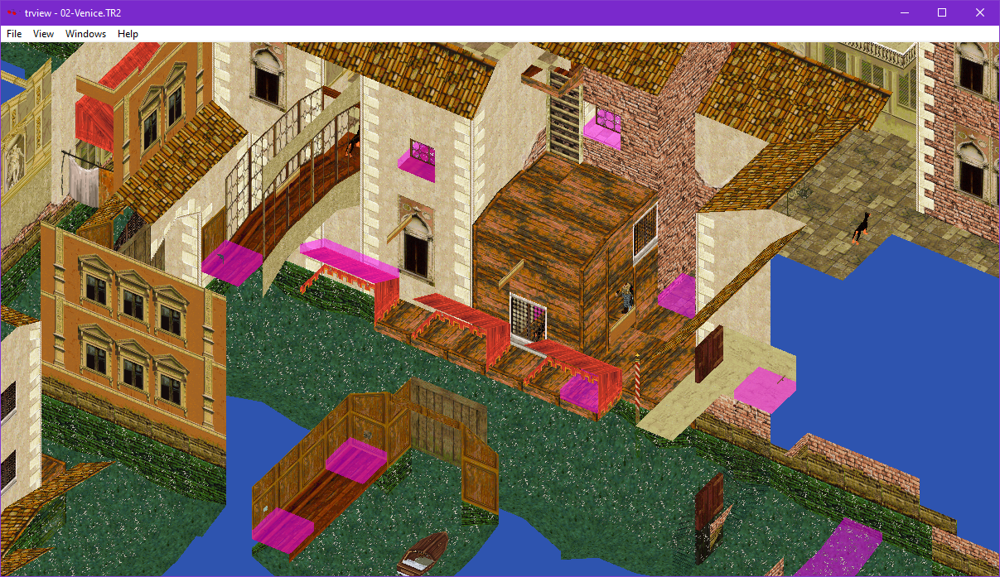

# Camera

Shows options for the camera.

## Camera Mode
Option|Action
---|------
Orbit               | Use orbit mode - this orbits a room or item
Free                | Use free mode
Axis                | Use axis mode - this is like free, but the controls map to X/Z/Y axis (rotation is ignored)

## Projection mode

Controls the way the camera is projected. Perspective is how we see the world whereas orthographic removes any distortion from depth.

Option|Action
---|------
Persepective | Use persepective projection
Orthographic | Use orthographic projection

### Perspective
 

### Orthographic

Orthographic mode can be useful when paired with the compass selector to choose a fixed camera orientation. You can use this to create a top-down camera without any perspective.

## Reset
Reset the orbit camera to default rotation.