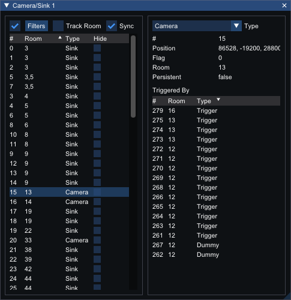

# Camera/Sink Window
_Shortcut: Ctrl + K_

## Options

Input|Action
---|------
Filters | Open the [filters](filters.md) editor. The checkbox toggles whether configured filters are applied.
Track Room          | Whether to show the camera/sinks that are in the currently selected room
Sync | Whether the camera/sink selected in the window will be synced with the camera/sink selected in the view (bidirectional)

## Camera/Sink List

Column | Meaning
---|---
\# | The camera/sink number
Room | The number of the room that the camera/sink is in
Type | The type name of the camera/sink
Hide | Whether to hide this camera/sink in the viewer

## Camera/Sink Details

The type of the camera/sink can be swapped between camera and sink to see the different interpretation of the values.

Stat | Camera/Sink Type
--- | ---
Type | Both
\# | Both
Position | Both
Room | Camera
Persistent | Camera
Strength | Sink
Box Index | Sink
Inferred Room | Sink

## Triggered By
The `Triggered By` list shows the triggers that can trigger the camera/sink. Clicking a trigger in the list will select that trigger.

Column | Meaning
---|---
\# | The trigger number
Room | The number of the room that the trigger is in
Type | The type name of the trigger