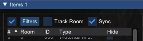

# Filters

Filters can used and combined to build a query to find items based on their properties. The following windows currently support filters:
- `Items`
- `Triggers`
- `Lights`
- `Rooms`
- `Camera/Sink`

## Using Filters

Filters are enabled by default in each window. The usage of the current filter can be toggled with the checkbox next to the `Filters` button on each window. The filters editor can be opened by clicking the `Filters` button. New filters can be added with the `+` button and deleted with the `X` button.

When multiple filters are defined they can be combined with different operators.

The contents of the list will be filtered and show the items that satisfy all of the conditions.

## Compare Operations

Different comparison operators are available depending on the data type of the selected property and whether it is a single or multi-value property.

| Name | String | Number | Boolean | Number of Values |
| ---- | ------ | ------ | ------- | ---- |
| Is   | &check; | &check; | &check; | 1 |
| Is not   | &check; | &check; | &check; | 1 |
| Greater than   | &cross; | &check; | &cross; | 1 |
| Greater than or equal   | &cross; | &check; | &cross; | 1 |
| Less than   | &cross; | &check; | &cross; | 1 |
| Less than or equal  | &cross; | &check; | &cross; | 1 |
| Between   | &cross; | &check; | &cross; | 2 |
| Between inclusive   | &cross; | &check; | &cross; | 2 |
| Is Present*  | &check; | &check; | &check; | 0 |
| Is not Present | &check; | &check; | &check; | 0 |

If the value is a multi value property such as `Triggered By` on an `Item` then two additional operations: `is present` and `is not present` are available. This will return whether there are any values for that property on the item being tested.

## Combining Filters

Filters can be comined with either `And` or `Or`. Filters are combined in the order they are defined.
