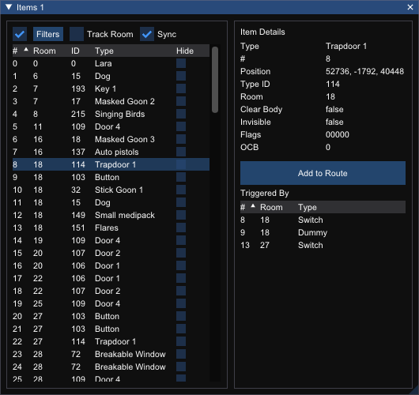

# Items Window

Shows the list of items that exist in the current level and allows you to filter, sort, inspect and add items to a route.

## Options

Input|Action
---|------
Filters | Open the filters editor. The checkbox toggles whether configured filters are applied.
Track Room          | Whether to show the items that are in the currently selected room
Sync | Whether the item selected in the window will be synced with the item selected in the view (bidirectional)

## Items List

Column | Meaning
---|---
\# | The item number
Room | The number of the room that the item is in
ID | The type ID of the item
Type | The type name of the item
Hide | Whether to hide this item in the viewer

## Item Details

Stat | Meaning
--- | ---
Type | The type name of the item
\# | The item number
Position | The position of the item in world space
Type ID | The type ID of the item
Room | The number of the room that the item is in
Clear Body | Whether to remove a dead body when a bodybag trigger is triggered
Invisible | Whether this item is invisible
Flags | Entity activation flags
OCB | Used to change entity behaviour

## Add To Route
Clicking the `Add to Route` button will insert this item at the current position in the route.

## Triggered By
The `Triggered By` list shows the triggers that can trigger the item. Clicking a trigger in the list will select that trigger.

Column | Meaning
---|---
\# | The trigger number
Room | The number of the room that the trigger is in
Type | The type name of the trigger
