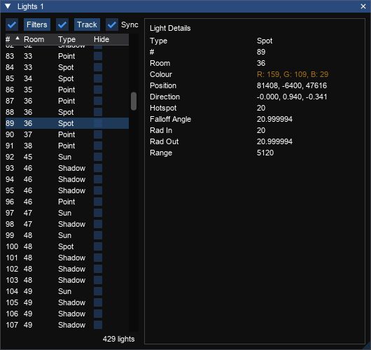

# Lights Window
_Shortcut: Ctrl + L_

## Options

Input|Action
---|------
Filters | Open the [filters](filters.md) editor. The checkbox toggles whether configured filters are applied.
Track Room          | Whether to show the items that are in the currently selected room
Sync | Whether the light selected in the window will be synced with the light selected in the view (bidirectional)

## Lights List

Column | Meaning
---|---
\# | The light number
Room | The number of the room that the light is in
Type | The type name of the light
Hide | Whether to hide this light in the viewer

## Light Details

Stat | Light Type | Game Version
--- | --- | ---
Type | All | All
\# | All | All 
Room | All | All
Position | Point, Spot, Shadow, Fog Bulb | All 
Intensity |Point, Spot| TR1-3
Fade |Point, Spot|TR1-3
Colour | Point, Spot, Sun, Shadow  | TR3+
Direction |Sun, Spot|TR3+
Intensity |Point, Spot, Shadow, Fog Bulb|TR1-4
Hotspot|Point, Spot, Shadow|TR4+
Falloff|Point, Shadow|TR4+
Falloff Angle|Spot|TR4+
Length|Spot|TR4
Cutoff|Spot|TR4
Rad In|Spot|TR5
Rad Out|Spot|TR5
Range|Spot|TR5
Density|Fog Bulb|TR4+
Radius|Fog Bulb|TR4+

### Light Types

Type | Games
---|---
Point|All
Spot|TR3+
Sun|TR3+
Shadow|TR4+
Fog Bulb|TR4+
