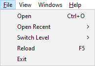

# Menus

## File

Action|Meaning
---|---
Open|Open a level file
Open Recent|Open a recently opened file. The number of recent files can be changed in the [settings] window.
Switch Level|Open another level in the same folder as the currently opened level file.
Reload|Reload the current level from file
Exit|Close trview

## View

Action|Meaning
---|---
UI|Toggle on or off visibility of all UI elements. This will override the other visibility options below if set to off.
Minimap|Toggle visibility of the minimap.
Tooltip|Toggle visibility of the tooltip when hovering over elements in the viewer.
Compass|Toggle visibility of the compass.
Selection|Toggle visibility of the selection highlights.
Route|Toggle visibility of the route waypoints and paths.
Tools|Toggle visibility of the tools, such as the measure tool.
Unhide All|Unhides anything that has been hidden via the context menu or their windows.

## Windows

Action|Meaning
---|---
Items|Create a new [items window](itemswindow.md)
Triggers|Create a new [triggers window](triggerswindow.md)
Rooms|Create a new [rooms window](roomswindow.md)
Route|Create or open the [route window](routewindow.md)
Lights|Create a new [lights window](lightswindow.md)
Camera/Sink|Create a new [camera/sink window](camerasinkwindow.md)
Log|Create a new [log window](logwindow.md)
Textures|Create a new [textures window](textureswindow.md)
Console|Create a new [console window](consolewindow.md)
Plugins|Create a new [plugins window](pluginswindow.md)
Statics|Create a new [statics window](staticswindow.md)
Reset Layout|Clear any UI customisations that have been applied
Reset Fonts|Reset the font face and size to default

## Help

Action|Meaning
---|---
Github|Go to the trview GitHub page
Discord|Permanent invite to the trview Discord
About|Show the about box
