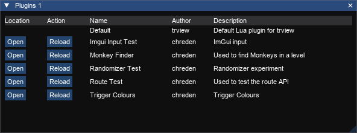

# Plugins

The plugins window shows the plugins that have been loaded from the configured plugins directories. The plugins directories can be managed from the [settings window](settings.md).

Action|Usage
---|---
Open|Opens the directory for the plugin in explorer.
Reload|Attempts to reload the plugin from file. 

