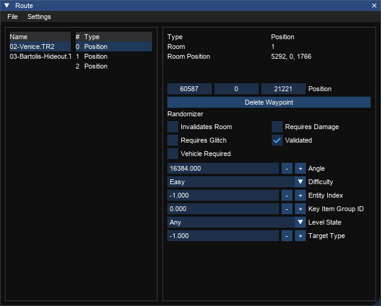

# Randomizer Integration

TRView has an integration with the [Randomizer](https://github.com/DanzaG/TR2-Rando) that allows you to import and export waypoints from and to Randomizer location files.

## Enabling
To enable the integration check the 'Enable Randomizer Tools' box in the TRView settings menu.

## Configuring
Before you can use the integration properly you will need to configure it. You will need to create a file called `randomizer.json` in the `%LOCALAPPDATA%/trview` folder, next to the TRView `settings.txt` file. The contents of this file should be obtained from the Randomizer project, but this is an example for demonstrative purposes:

```
{
    "fields": {
        "Setting1": {
            "default": "Easy",
            "display": "Setting 1",
            "options": ["Easy", "Medium", "Hard"],
            "type": "string"
        },
        "Setting2": {
            "default": false,
            "display": "Setting 2",
            "type": "boolean"
        },
        "Setting3": {
            "default": 10,
            "display": "Setting 3",
            "type": "number",
            "always_output": true
        },
        "Setting4": {
            "default": "default text",
            "display": "Setting 4",
            "type": "string"
        }
    }
}
```

All settings are defined in the `fields` field. TRView will load this on startup and generate the appropriate UI elements in the route window. These elements will be visible if the randomizer tools are enabled.

## Setting
Each setting is given a unique key. This is the value as it appears in the JSON for the Randomizer.

### default
The default value for a property. This is the value initially given to a waypoint. If a waypoint has the same value as the default it will not be saved into the JSON unless the `always_output` property is `true`.

### display
The text used for the control label in the route window.

### type
The variable type. This controls the UI that is generated by TRView. The options are: `boolean, string, number`. 

### options
Only available when the `type` is `string`. This is a set of values that the user will be able to choose from - if a setting has an `options` entry then a dropdown will be generated instead of a free text area.

### always_output
If set to `true` then the value for this attribute will always be saved in the JSON even if it matches the default. Otherwise if `false` or absent it will check against the `default` value first and skip if they match.

## Generated UI
The settings above will generate the UI below.



## Import and Export
TRView can import locations from Randomizer location files, as long as the level name exactly matches the name in the location file. Select the Randomizer location file filter on the route import dialog to do this.

TRView can export into Randomizer location files as long as the level names matches the one in the json file. Select the Randomizer filter in the export menu to do this.