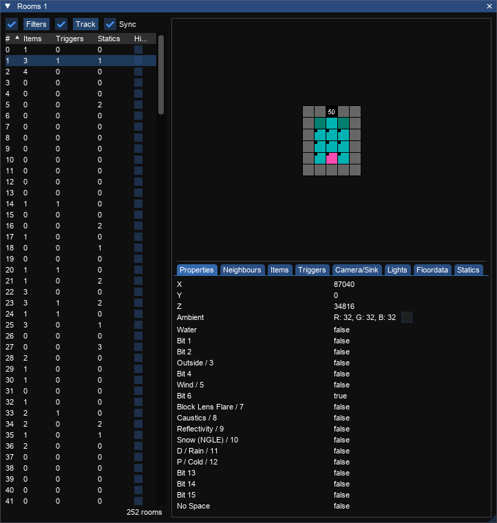

# Rooms Window
_Shortcut: Ctrl+M_

Shows the list of rooms that exist in the current level and allows you to filter, sort and inspect rooms.

## Options

Input|Action
---|------
Filters | Open the [filters](filters.md) editor. The checkbox toggles whether configured filters are applied.
Sync | Whether the room selected in the window will be synced with the room selected in the view (bidirectional)
Track | Whether to change the selected room when items or triggers are selected. Clicking the button will show the expanded track menu where you can choose what to track.

## Rooms List

Column | Meaning
---|---
\# | The room number
Items | The number of the items in the room
Triggers | The number of triggers in the room
Statics | The number of static meshes in the room
Hide | Show/Hide the room in the 3D view

## Minimap

The minimap shows the sectors in the currently selected room.

Key|Action
---|------
Left click          | If a trigger square, will select the trigger. If not a trigger (or `CTRL` is pressed) it will follow a portal, or go to the room below. 
Right click         | Goes to the room above, if one is present.

## Tabs
Rooms have a lot of properties and contents so there are tabs for each part. 

### Properties

Lists the various properties of the room.

Property | Meaning | Notes
---|---|---
X | X position of the room
Y | Y position of the room
Z | Z position of the room
Ambient | Ambient lighting in the room
Water | Whether the water bit flag is set | Bit 0
Bit 1 | Whether bit 1 is set
Bit 2 | Whether bit 2 is set
Outside / 3 | Whether the room can see the skybox | Bit 3
Bit 4 | Whether bit 4 is set
Wind / 5 | Whether there is wind in the room | Bit 5
Bit 6 | Whether bit 6 is set
Quicksand / Block Lens Fare / 7 / | In TR3 specifies a quicksand room. In TR4+ blocks global lens flare | Bit 7
Caustics / 8 | Whether bit 8 is set
Reflectivity / 9 | Whether bit 9 is set
Snow / 10 | Whether bit 10 is set | Bit 10 (Snow in NGLE)
Rain / D / 11 | Whether bit 11 is set | Bit 11 (Rain in NGLE, D in TRLE)
Bit 12 | Whether bit 12 is set | Bit 12 (Cold in NGLE, P in TRLE)
Bit 13 | Whether bit 13 is set
Bit 14 | Whether bit 14 is set
Bit 15 | Whether bit 15 is set
No Space | Whether this room contains no-space entry

### Neighbours

Shows the rooms that are immediate neighbours of this room. Clicking one of the rooms will select it.

Column | Meaning
---|---
\# | The room number

### Items

Shows the items that are contained in the room. Clicking an item will select it in the viewer.

Column | Meaning
---|---
\# | The item number
Type | The type of the item triggered

### Triggers

Shows the triggers that are in the room. Clicking one will select it in the viewer.

Column | Meaning
---|---
\# | The trigger number
Type | The type of trigger

### Camera/Sink

Shows the camera/sinks that are in the room. Clicking one will select it in the viewer.

Column | Meaning
---|---
\# | The camera/sink number
Type | The type of camera/sink

### Lights

Shows the lights that are in the room. Clicking one will select it in the viewer.

Column | Meaning
---|---
\# | The light number
Type | The type of light

### Floordata

Shows the floordata for the selected sector. Clicking the minimap when the floordata tab is selected will allow you to select a sector.

If the `Raw` checkbox is checked there will be no meaning attached to any of the floordata values. If unchecked trview will interpret the values.

Column | Meaning
---|---
\# | The floordata number
Value | The value of the floordata
Meaning | What the value means (only present if `Raw` in unchecked)

### Statics

Shows the statics that are in the room. Clicking one will select it in the viewer.

Column | Meaning
---|---
\# | The static number
ID | The mesh ID of the static