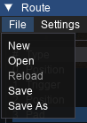
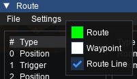
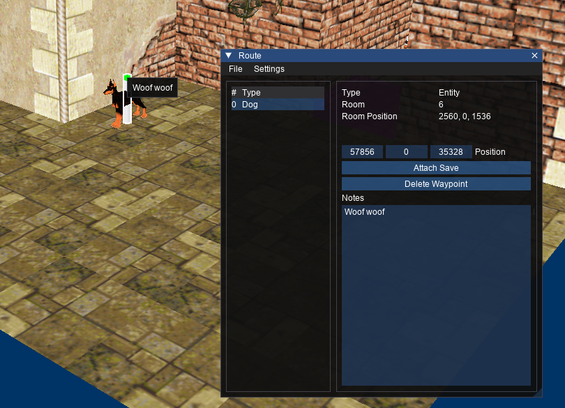

# Route Window

_Shortcut: Ctrl + R_

Shows the list of waypoints in the current route and allows them to be edited and rearranged.

## File

### New

Create a new route.

### Open

Opens a dialog to select a trview route file to import. Opening a route file will replace the current route.

### Reload

Reloads the currently opened route from the file it was loaded from.

### Save

Saves the route to the currently opened route file.

### Save As

Opens a dialog to export a trview route file to file.

## Settings

Clicking on the settings button will allow you to change route and waypoint colours. Clicking on each coloured square will show a colour picker dialog. The colours you choose will be used in the 3D view. The visibility of the line between waypoints can also be toggled.

## Waypoint List

Shows the waypoints that make up the current route. Clicking a waypoint will show the details of that waypoint in the route window and select it in the viewer. Waypoints can be rearranged by dragging and dropping them.

Column|Meaning
---|------
\# | Position of the waypoint in the route
Type | The waypoint type

## Waypoint Details
Shows various stats about the waypoint.

Stat | Meaning
---|---
Type | Waypoint type. Possible values: Position, Entity, Trigger.
Position | Position of the waypoint in the world
Room | The room the waypoint is in
Room Position | The position of the waypoint in room coordinates

## Saves
A save file can be attached to each waypoint.

Button | Action | Note
---|---|---
Attach Save | Opens a dialog to select a save file | Only available when there is no file attached. Right clicking the button when a save is attached will allow you to remove the attachment.
SAVEGAME.0 | Opens a dialog to export the attached save file | Only available when there is a file attached

## Delete Waypoint
Deletes the waypoint from the route.

## Notes
Shows and allows editing of the notes associated with this waypoint.

The selected waypoint will have its details shown in the right panel. The notes for the route can be edited by typing in the 'Notes' text area. These notes are visible in the Viewer when the Notes view option is enabled.

