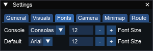

# Settings

The settings window allows you to change how parts of trview behave.

## General

## Visuals

## Fonts

Available fonts are TTF fonts that have been installed on the system.

## Camera

## Minimap

## Route

## Plugins

Plugin directories are scanned on program start to find plugins to load. More folders can be added with the `Add` button. Plugins themselves can be seen in the [plugins window](pluginswindow.md).