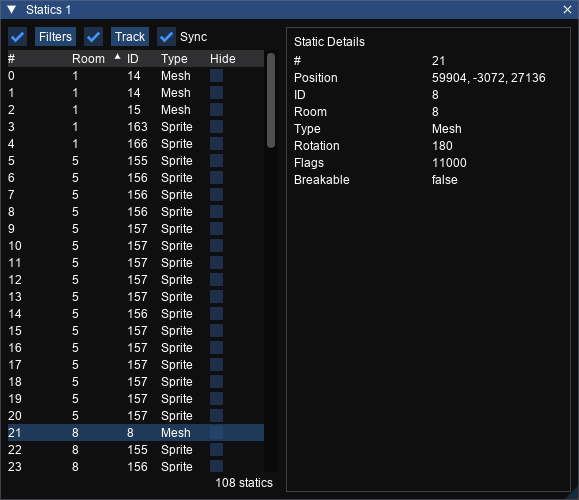

# Statics
_Shortcut: Ctrl+S_

Shows the list of statics that exist in the current level and allows you to filter, sort and inspect them.

## Options

Input|Action
---|------
Filters | Open the [filters](filters.md) editor. The checkbox toggles whether configured filters are applied.
Track Room          | Whether to show the statics that are in the currently selected room. Clicking the button will show the expanded track menu where you can choose whether rooms are tracked.
Sync | Whether the static selected in the window will be synced with the static selected in the view (bidirectional)

## Statics List

Column | Meaning
---|---
\# | The statics number
Room | The number of the room that the static is in
ID | The mesh ID of the static
Type | The type of the static
Hide | Whether to hide this static in the viewer

## Static Details

Stat | Meaning
--- | ---
\# | The static number
Position | The position of the static in world space
ID | Mesh ID of the static
Room | The number of the room that the static is in
Type | The type of the trigger
Rotation | Rotation of the static mesh in degrees
Flags | Activation mask
Breakable | Whether this static can be broken (eg jars)
