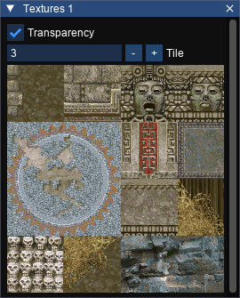

# Textures Window

Shows the texture tiles in the level.

## Transparency

Enable or disable transparency on the textures in the tile.

## Tile

Select a different tile from the textures in the level.