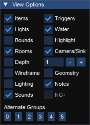
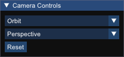
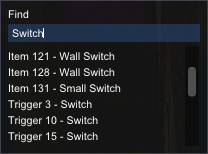
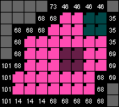
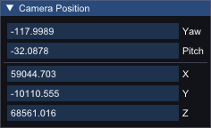
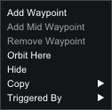

# Viewer

The viewer is the main 3D view for trview. It shows and and allows you to interact with the current level.

## View Options

Controls the appearance of the level in the 3D view.

TR1-3 | TR4+
---|---
 | 

Option|Action
---|------
Items               | Toggle item visibility
Triggers            | Toggle trigger visibility
Lights              | Toggle lights visibility
Water               | Toggle water in water rooms
Bounds              | Show static mesh bounding boxes
Highlight           | Highlight the currently selected room
Rooms               | Toggle rendering of room geometry
Camera/Sink         | Toggle rendering of cameras and sinks
Depth               | Toggle depth mode. This will show the currently selected depth of neighbours of the current room.
Depth Selector      | Choose the depth of neighbours to show
Wireframe           | Enable wireframe rendering mode
Geometry            | Toggle geometry mode
Lighting            | Toggle using room lighting
Notes               | Toggle notes visibility
Flip                | Toggle the level flipmap (if present in the level). In TR4+ this will be a flipmap group selector.

## Room Navigator

The room navigator shows the current room, the number of rooms in the level and allows you to enter a room number or cycle through them with the `-` or `+` buttons.

Option|Action
---|---
Number input       | Enter a room number and press `Enter` to go to it
`-` | Go to the previous room (hold `CTRL` to skip by 10)
`+` | Go to the next room (hold `CTRL` to skip by 10)

## Camera Controls

Shows options for the camera.

### Camera Mode
Option|Action
---|------
Orbit               | Use orbit mode - this orbits a room or item
Free                | Use free mode
Axis                | Use axis mode - this is like free, but the controls map to X/Z/Y axis (rotation is ignored)

### Projection mode

Controls the way the camera is projected. Perspective is how we see the world whereas orthographic removes any distortion from depth.

Option|Action
---|------
Perspective | Use perspective projection
Orthographic | Use orthographic projection

#### Perspective
 

#### Orthographic

Orthographic mode can be useful when paired with the compass selector to choose a fixed camera orientation. You can use this to create a top-down camera without any perspective.

### Reset
Reset the orbit camera to default rotation.

## Find
_Shortcut: Ctrl+F_

Enter the number or name to search through all available items, triggers or rooms. The results will be presented below and selecting them with the arrow keys or clicking them will select them in the viewer.

## Minimap

Shows relevant triggers, portals and floor data from the currently selected room.

Key|Action
---|------
Left click          | If a trigger square, will select the trigger. If not a trigger (or `CTRL` is pressed) it will follow a portal, or go to the room below. 
Right click         | Goes to the room above, if one is present.

## Level Info

The level info display useful information about the current level.

### Game Version
An icon representing the version of the game is displayed to the left of the level name.

### Level Name
The filename of the current level is displayed for reference.

### Settings
Clicking the settings button will open [Settings](settings.md) for trview.

## Measure

The measure tool can be used to measure a distance: 
* Click on the measure button at the bottom of the 3D view or press the M key 
* Click on a point in the world
* Click on a second point
A path will appear between the two points with a distance label. This is the distance in units of 1024.

## Compass

When a level is open the 3D compass is displayed at the bottom right.

This shows the current direction of each axis, relative to the current camera view. 
Each of the nodes at the end of the axis lines can be clicked on to align the camera to that direction. Hovering over a node will show a tooltip with the name of the axis and the direction.

Node|Axis
---|---
Red|Y
Green|X
Blue|Z

## Camera Position

The camera position window shows and allows you to edit the position and rotation of the camera.

Property|Meaning|Notes
---|---|---
Yaw|Rotation around the vertical axis (looking left and right)|Can be displayed in degrees or radians depending on settings
Pitch|Rotation around the horizontal axis (tilting up and down)|Can be displayed in degrees or radians depending on settings
X|X position of the camera in level space|
Y|Y position of the camera in level space|
Z|Z position of the camera in level space|

## Context Menu

Normal|Copy|Triggered By
---|---|---
 |  |  

The context menu is opened by right clicking in the 3D view.

Action|Meaning
---|---
Add Waypoint|Add a new route waypoint at this position. This is only available when a surface was clicked.
Add Mid Waypoint|Add a new route waypoint at the centre of the square that was clicked. This is only available when a floor was clicked.
Remove Waypoint|Remove the clicked waypoint from the route. This is only available when a waypoint was clicked.
Orbit Here|Switch the camera to orbit mode and orbit around the position that was right clicked when the context menu was opened.
Hide|Hide the clicked entity or trigger. This can be unhidden from the view menu or the items or triggers window. This is only available if an item or trigger was clicked.
Copy|Copy the position of the click or the entity number to the clipboard.
Triggered By|Shows the triggers that trigger an entity. Clicking an entry will select the trigger.